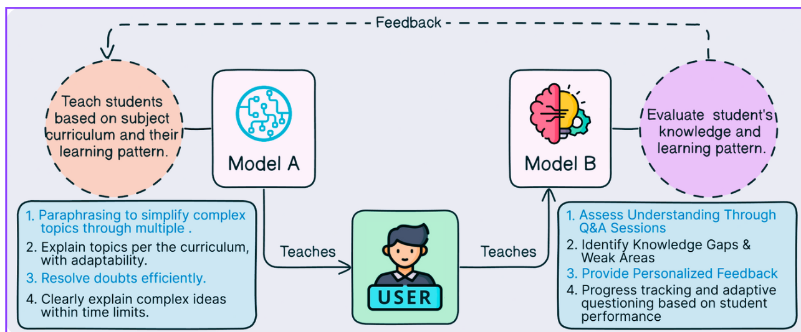
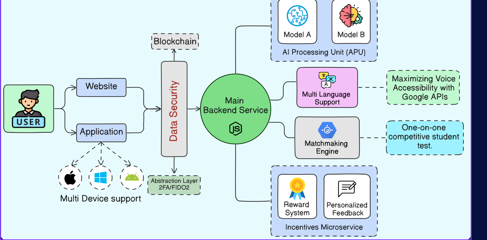

# AscentAI
### 🎓 AI-Based Personalized Learning Platform

An intelligent learning system that adapts to each student's pace and learning style using AI. This project combines personalized teaching and evaluation to ensure step-by-step progress tracking and continuous improvement.

---

## Presentation Video 
- [Link to Video](https://drive.google.com/file/d/1kNVVNWmuF5FNsfqx-2xRNdrZ6lRTTeGR/view?usp=sharing)

---

## 🚀 Features

- 🎯 **Personalized Learning**: Students learn at their own pace with tailored content.
- 🧠 **Dual AI Models**:
  - **Teaching Model**: Delivers customized lessons.
  - **Evaluator Model**: Learns from user behavior and tracks progress.
- 📊 **Progress Tracking**: Continuous monitoring and insights on learning growth.
- 📈 **Feedback System**: Real-time feedback to guide student improvement.
- 🌐 **Accessible Anytime**: Learn from anywhere, anytime.

---

## 📌 Use Case Diagram Overview

**Actors**:
- Student  
- AI Teaching Model  
- AI Evaluator Model

**Use Cases**:
- Learn at Own Pace  
- Receive Personalized Lessons  
- Get Evaluated  
- Track Progress  
- View Feedback

*For a detailed diagram, check the `docs/` folder or open `use_case_diagram.png`.*

---

## 🛠️ Tech Stack

- Python / JavaScript (adjust based on what you're using)
- Machine Learning / Deep Learning
- Flask / Node.js backend
- React / HTML-CSS frontend
- Database: MongoDB / Firebase / PostgreSQL
- AWS S3
- RabbitMQ

---

## High Level Diagrams

